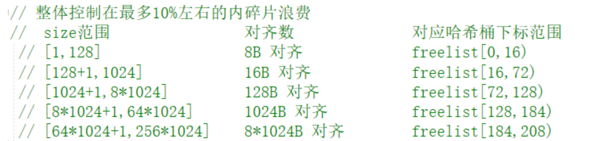

# Tinytcmalloc
化简版tcmalloc

3.10   实现定长内存池

3.11   初步实现ThreadCache

3.12   实现ThreadCache，不过还有需要完善的地方

3.13   初步实现CentralCache
            Span实现 ok
            SpanList实现
            实现单例CentralCache  ok
            实现FetchFromCentralCache  
            实现FetchRangeObj    从CentralCache的span中获取空间

正常内存池要考虑的两个大问题：
    效率问题
    内存碎片问题
    多线程场景下申请和释放的空间的效率问题   （高并发内存池）
    
内存对齐规则如下
